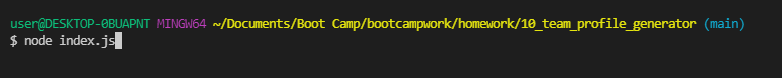
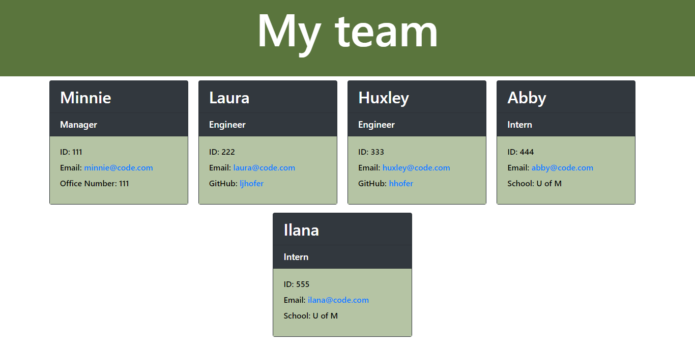

# Team Profile Generator
Bootcamp Homework #10

# Professional README Generator

Bootcamp Homework #10

## Description 
I have created a command line application that dynamically creates an HTML file based on user imput. The user starts by entering information about the team manager and then can add information about engineers and interns. This final webpage includes a box for each employee and clickable links for email and GitHub, where applicable. 
    
## Table of Contents

- [Installation](#installation)
- [Usage](#usage)
- [License](#license)
- [Contributions](#contributions)
- [Testing](#testing)
- [Questions](#questions)

## Installation
This application requires Node and users should run "npm install" in their command line prior to use. 

## Usage
After installing Node and running "npm install" users will open their command line and initiate the program by typing "node index.js". 

Then answer the questions with the information you would like included in your HTML file. 

After entering all of your information, the program will create a index.htim file in your folder. 

[Click here for a video showing how to use the program.](https://drive.google.com/file/d/11LYdCyM8oht5Igig2Y0dc03oUKxzTAHL/view)

## License
This project licensed under the [MIT License](https://opensource.org/licenses/MIT).

## Testing
This project includes unit testing for the properties and functions within each class and subclass. It passes all of the included tests using Jest. 

## Contributions
Please contact me at <ljhofer@gmail.com> to discuss contributions.

## Questions
Please email any questions to <ljhofer@gmail.com> or reference my [GitHub profile](https://github.com/ljhofer). 
